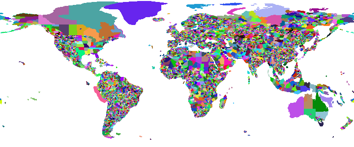

# Incredibly Fast Reverse Geocoding with OpenStreetMap Data

The goal of this project is to build a primitive but incredibly fast
reverse geocoding (coordinates to location lookup) system.

The basic principle is simple:
- extract polygons of each administrative region on OpenStreetMap (OSM)
- build a lookup map that can be stored reasonably
- to geocode coordinates, look them up in the map

The map will look roughly like this
(this is a visualization of the lookup map with 0.5 degree resolution
-- the finest has the 1000 fold resolution!):

However, things with OSM are not as easy as one may expect:

- OSM is a *lot* of data. It may use up all your memory easily.
  We are talking of 2.7 *billion* nodes for the planet file,
  and 270 million ways and 3.1 million relations.
  32 bits are not enough to store the IDs.
- The dump file is not well suited for random access. Instead, you
  need to process it in sequence. There are optimized data structures in
  the PBF file format that exploit delta compression; and strings are shared
  via a dictionary - and trust me, you don't want to process the XML dump
  using a DOM parser and XPath either...
- To reduce maintainance, OSM is heavily designed to share nodes and ways for
  multiple purposes. In particular for boundaries a single way can be used
  multiple times, such as denote the border of two countries, and participating
  in the polygons of countries, counties, cities at the border, ...
- Assembling polygons in OSM is quite tricky; and often polygons are incomplete
  (see also the documentation on [OSM multipolygons](http://wiki.openstreetmap.org/wiki/Relation:multipolygon))

My first prototypes in Python were running out of memory on the full data set;
reducing the data set via Osmosis did not work, as it led to missing ways. So I
needed to carefully build this in Java, to conserve memory. Osmosis reads and
writes data multiple times (to large temporary files) - I decided to design my
approach around reading the input data multiple times instead, even if this
means re-reading data unnecessarily, at the benefit of not having to write
large temporary files.

## Index Query

Quering the index is easy. It requires a single class,
[ReverseGeocoder](src/main/java/com/kno10/reversegeocode/query/ReverseGeocoder.java),
and a data file ([pregenerated data available under the ODbL license](data/))

**This class only depends on the JDK, on no other classes or packages.**

In particular, **you do not need a Mavenized package of this project**. For this reason,
I have also chosen a very permissive 2-clause BSD license for the lookup code.

    ReverseGeocoder rgc = new ReverseGeocoder(filename);
    // ...
    String[] metadata = rgc.lookup(longitude, latitude);

Pay attention to the order of longitude and latitude! The order of these two values
is inconsistent across different applications. This has been a mess historically,
and we are not going to fix this here. We chose longitude, latitude because it seems
more intuitive to us to use x, y as commonly seen on a map. This is also the
order used by [GeoJSON](http://geojson.org/). (Plus, the run length
encoding supposedly works better this direction.)

Each metadata entry is a tab separated array, as generated by the parser from the OSM file.
The exact columns are easy to vary. For the provided data files, there is
[documentation in the data folder](data/).

## Performance

So how "incredibly fast" is it?

I've added JMH unit tests to benchmark the throughput on a i7-3770 CPU with 3.4 GHz.
Values are given in microseconds (1us = 1e-6 s) per operation, and operations per microsecond.

| Method                             | Resolution | Runtime      | Throughput    |
|:-----------------------------------|-----------:|-------------:|--------------:|
| Lookup with caching of entities    |      0.5-2 |  0.231 us/op |  4.316 ops/us |
| Lookup with caching of entities    |     0.05-2 |  0.575 us/op |  1.706 ops/us |
| Lookup with caching of entities    |    0.005-2 |  0.971 us/op |  1.052 ops/us |
| Lookup with caching of entities    |   0.0005-2 |  1.562 us/op |  0.639 ops/us |
| Lookup without caching of entities |      0.5-2 |  0.683 us/op |  1.439 ops/us |
| Lookup without caching of entities |     0.05-2 |  1.114 us/op |  0.928 ops/us |
| Lookup without caching of entities |    0.005-2 |  1.423 us/op |  0.668 ops/us |
| Lookup without caching of entities |   0.0005-2 |  2.057 us/op |  0.473 ops/us |
| Open, query, close cycles          |      0.5-2 | 13.542 us/op |  0.078 ops/us |
| Open, query, close cycles          |     0.05-2 | 21.221 us/op |  0.048 ops/us |
| Open, query, close cycles          |    0.005-2 | 36.250 us/op |  0.027 ops/us |
| Open, query, close cycles          |   0.0005-2 | 84.306 us/op |  0.013 ops/us |
| Random lon+lat pair generation     |        n/a |  0.047 us/op | 21.297 ops/us |

As you can see, there is a benefit from using the caching included, and the setup cost of
the memory map is not negligible - it takes 50 times as long to open the file than to query.

The benchmark queries *random* coordinates. Some of these will be at the poles and in oceans.
The index is designed to have very stable lookup times, but lookups in asia tend to be slightly
slower than lookups in America due to the run-length encoding. For most applications, the
differences should remain neglible. In particular, the runtime is expected to increase
sublinear with the data resolution, not quadratic as with a naive map.

The last line in above table benchmarks the random number generation. This runtime can
therefore be subtracted from the other values.
On the 0.005-2 resolution data set, a cached lookup therefore is about 924 ns.
In one second, we can perform over 1 million lookups. (1 ops/us = 1 million ops/s)

Caching is not applied to coordinates, but to the decoding of UTF-8,
`'\0'`-delimited data into
an array of Java strings. As you can see, the string operations take about 400-500 us/op.
If your code is natively operating on UTF-8 encoded,
0-terminated strings (e.g. C code) then this is not needed.

Lookup times increase sub-linear with the data set size:

|Method                           | Resolution | Table size | Runtime     |
|:--------------------------------|-----------:|-----------:|------------:|
| Random lon+lat pair generation  |            |            | 0.047 us/op |
| Lookup with caching of entities |      0.5-2 |   1.602 MB | 0.232 us/op |
| Lookup with caching of entities |     0.05-2 |   9.775 MB | 0.575 us/op |
| Lookup with caching of entities |    0.005-2 |  49.098 MB | 0.971 us/op |
| Lookup with caching of entities |   0.0005-2 | 389.979 MB | 1.562 us/op |

## OSM Data Extraction

We do a multi-pass process to build the index. **Unless you want to rebuild the index,
you can stop here. Everything you need to query is documented above.**

1. In the first pass, we ignore all nodes (the majority of the data).
We remember all ways and all relations we are interested in,
but no additional metadata to conserve memory.
2. We then build an index of the nodes we will need, and forget ways that we did not use.
3. In the second pass, we look at the nodes, but only keep those that we are
interested in. Since we only need a subset, this should fit into memory now
(at least if you have a machine with a lot of memory, like I do.)
4. In the third pass (since ways or nodes might be out of sequence), we
then can output the polygons for each relation, along with some metadata.

On my system, the each pass takes about 2 minutes (reading from a network share;
likely a lot faster if I had stored the source file on my SSD).

### Data Structures

We use Fastutil collections to conserve memory. These classes are excellent
hashmaps for *primitive* data types. For nodes, we also use a two level hashmap
with prefix compression, since node ids were given in sequence not randomly (and thus
have a lot of common prefixes - in particular, the first 20+ bits of each id are usually 0).

Since our desired output resolution is much less than 0.01 degree, we also encode
each coordinate approximately using a single integer.

### Implementation Notes

While `osmosis --used-way --used-node` did not work for me with tag filters, it
apparently worked just fine without. Using these filters can reduce the
planet file substantially, from 30 GB to 5.1 GB. This is worth
doing as a preprocessing step.

As of now, you *will* need to use a Debian Linux system.
Some of the libraries are not available on Maven central, so I had to put
system paths (have a look at the pom.xml, for what you need).

## Index construction

The index essentially is a large pixmap referencing metadata from OSM, accompanied
with a table containing the metadata from the index.

### Rendering

Rendering is currently done via JavaFX, so you will also need to have a UI for
building an index. Unfortunately, this is also rather slow (10-30 minutes,
depending on the desired resolution and number of polygons to render). However,
we needed an API that can render polygons with the even-odd rule and antialiasing,
and the java-gnome Cairo API wouldn't allow us access the resulting bitmaps without
writing them to disk as PNG.

Since the JavaFX renderer has a texture limit of 8192x8192, we need to render smaller patches
and combine them to get a high-resolution map.

### File Format

The file format is designed to be low-level, compact and efficient. It is meant to
be used via read-only shared memory mapping, to make best use of operating
system caching capabilities. The compression is less than what you could obtain with
PNG encoding or GZIP, but it allows skipping over data without decoding it into
application memory.

1. 4 bytes: magic header that identifies the file format. Currently,
this is the code 0x6e06e001, and I will increment the last byte on format changes.
2. 4 bytes: width of the map in pixel
3. 4 bytes: height of the map in pixel
4. 4 bytes: width of the map in degree
5. 4 bytes: height of the map in degree
6. 4 bytes: longitude offset of the map in degree (usually +180°)
7. 4 bytes: latitude offset of the map in degree
8. 4 bytes: number of entities (max 0x8000)
9. height * 4 bytes: file offset of each row (monotone increasing)
10. nument * 4 bytes: file offset of metadata (monotone)
11. file size (= end of last entity)
12. x bytes for each row, as listed before (row encoding: see below)
13. x bytes for each metadata

Each map row is encoded using a run-length encoding consisting of two varints.
The first varint is the entity number, the second is the run length - 1.
The varint encoding uses a variable number of bytes, where the first bit is 1
except for the last byte.

To compute the length of the metadata, read two consecutive index offsets and
compute the difference. Entries are UTF-8 encoded, and are both separated and
terminated with `\0` to make it easy to use them across different programming
languages.  Metadata usually includes tab characters to separate columns. The
exact column layout is not specified in this file format, but there is
[documentation in the data folder](data/) for the example data files provided.

This format is designed to provide reasonable compression, while still allowing
fast random access without having to decompress the full data. The UTF-8
encoded entities will often require decoding, and thus the sample implementation
includes a cache for the decoded strings.

## Visualization

The index construction will also produce a .png visualizing the map, as shown above.

## Improving the Data

I am aware there are areas where the data is not yet very good. For example in Portugal,
there is little detailed information, same for Western Australia. You are welcome to
contribute data: just contribute administrative boundaries
to [OpenStreetMap](http://www.openstreetmap.org/)!
For example there is a project to
[add administrative boundaries for Portugal](http://wiki.openstreetmap.org/wiki/WikiProject_Portugal/Divis%C3%B5es_Administrativas/Lista_de_Divis%C3%B5es_Administrativas),
that already improved the data quality of this index for Portugal substantially.
Isn't that great?

## TODO

1. Include ocean information
2. Fallback to other data for e.g. Western Australia?
3. Further reduce file size / coding (but not at the cost of speed)
4. Use a custom renderer (line-based with RLE to reduce memory?) instead of JavaFX

## Licensing

The index ''query'' code is using the liberal BSD 2-clause license.

The index ''construction'' code is AGPL-3 licensed (see [LICENSE](LICENSE)).
I am aware this is a rather restrictive license, but I believe in Copyleft and the GPL:
because I shared my code with you, you should also re-share your improvements, please.

The ''data'' is derived from OpenStreetmap, and thus under the
[Open Data Commons Open Database License](http://www.openstreetmap.org/copyright)
and you are required to give credit as "© OpenStreetMap contributors".

