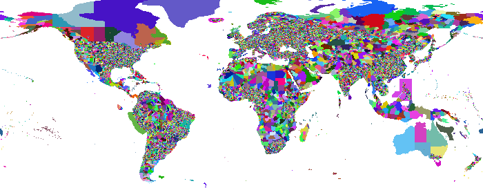

# Simple (but fast) reverse Geocoding with OpenStreetMap data

The goal of this project is to build a primitive but fast reverse geocoding
(coordinates to location lookup) system.

The basic principle is simple:
- extract polygons of each administrative region on OpenStreetMap (OSM)
- build a lookup map that can be stored reasonably
- to geocode coordinates, look them up in the map

The map will look roughly like this (this is, in fact, a scaled down map as produced by
this tool when visualization is enabled - the full image has 36000x14000 pixels):

However, things with OSM are not as easy as one may expect:
- OSM is a *lot* of data. It may use up all your memory easily.
  We are talking of 2.7 *billion* nodes for the planet file,
  and 270 million ways and 3.1 million relations.
  32 bits are not enough to store the IDs.
- The dump file is not well suited for random access. Instead, you
  need to process it in sequence. There are optimized data structures in
  the PBF file format that exploit delta compression; and strings are shared
  via a dictionary - and trust me, you don't want to process the XML dump
  using a DOM parser and XPath either...
- Polygons in OSM are tricky, in particular [multipolygons](http://wiki.openstreetmap.org/wiki/Relation:multipolygon)

My first prototypes on the full data always were running out of memory; reducing
the data set via Osmosis did not work, as it led to missing ways. So I needed
to carefully build this in Java, to conserve memory. Osmosis reads and writes data
multiple times (to large temporary files) - I decided to design my approach around
reading the input data multiple times instead, even if this means re-reading data
unnecessarily, at the benefit of not having to write large temporary files.

## Index Query

Quering the index is easy. It requires a single class,
[ReverseGeocoder](src/main/java/com/kno10/reversegeocode/query/ReverseGeocoder.java),
and a data file (for example, [osm-20150126-0.01.bin](data/osm-20150126-0.01.bin) or
if you prefer a coarser resolution [osm-20150126-0.02.bin](data/osm-20150126-0.02.bin)).

    ReverseGeocoder rgc = new ReverseGeocoder(filename);
    // ...
    String[] metadata = rgc.lookup(longitude, latitude).split("\t");

Pay attention to the order of longitude and latitude! The order of these two values
is inconsistent across different applications. This has been a mess historically,
and we are not going to fix this here. We chose longitude, latitude because it seems
more intuitive to us to use x, y as commonly seen on a map.

## OSM Data Extraction

We do a multi-pass process.

1. In the first pass, we ignore all nodes (the majority of the data).
We remember all ways and all relations we are interested in,
but no additional metadata to conserve memory.
2. We then build an index of the nodes we will need, and forget ways that we did not use.
3. In the second pass, we look at the nodes, but only keep those that we are
interested in. Since we only need a subset, this should fit into memory now
(at least if you have a machine with a lot of memory, like I do.)
4. In the third pass (since ways or nodes might be out of sequence), we
then can output the polygons for each relation, along with some metadata.

On my system, the each pass takes about 2 minutes (reading from a network share;
likely a lot faster if I had stored the source file on my SSD).

### Data Structures

We use Goldman-Sachs collections to conserve memory. These classes are excellent
hashmaps for *primitive* data types. For nodes, we also use a two level hashmap
with prefix compression, since node ids were given in sequence not randomly (and thus
have a lot of common prefixes - in particular, the first 20+ bits of each id are usually 0).

Since our desired output resolution is much less than 0.01 degree, we also encode
each coordinate approximately using a single integer.

### Implementation Notes

While osmosis --used-way --used-node did not work for me with tag filters, it
apparently worked just fine without. Using these filters can reduce the
planet file substantially, to about 13% of the planet file. This is worth
doing as a preprocessing step. It reduces the node count from 2.1 billion to
"just" 460 million, the number of ways to 17 million (the number of relations
remains unchanged, obviously). This way, 8 GB of RAM should be enough.

As of now, you *will* need to use a Debian Linux system.
Some of the libraries are not available on Maven central, so I had to put
system paths (have a look at the pom.xml, for what you need).

## Index construction

The index essentially is a large pixmap referencing metadata from OSM, accompanied
with a table containing the metadata from the index.

### Rendering

Rendering is currently done via JavaFX, so you will also need to have a UI for
building an index. Unfortunately, this is also rather slow (10-30 minutes,
depending on the desired resolution and number of polygons to render). However,
we needed an API that can render polygons with the even-odd rule and antialiasing,
and the java-gnome Cairo API wouldn't allow us access the resulting bitmaps without
writing them to disk as PNG.

Since the JavaFX renderer has a texture limit of 8192x8192, we need to render smaller patches
and combine them to get a high-resolution map.

### File Format

The file format is designed to be low-level, compact and efficient. It is meant to
be used via read-only shared memory mapping, to make best use of operating
system caching capabilities. The compression is less than what you could obtain with
PNG encoding or GZIP, but it allows skipping over data without decoding it into
application memory.

1. 4 bytes: magic header that identifies the file format. Currently,
this is the code 0x6e06e000, and I will increment the last byte on format changes.
2. 2 bytes: width of the map in pixel
3. 2 bytes: height of the map in pixel
4. 4 bytes: width of the map in degree
5. 4 bytes: height of the map in degree
6. 4 bytes: longitude offset of the map in degree (usually +180°)
7. 4 bytes: latitude offset of the map in degree
8. 2 bytes: number of entities (max 0x8000)
9. height * 2 bytes: length of each row
10. x bytes for each row, as listed before (row encoding: see below)
11. nument * 2 bytes: length of metadata entries
12. x bytes for each metadata

Each row is encoded using a run-length encoding. Either 2 or 3 bytes compose a run.
The highest bit indicates repetitions, the remaining 15 bit indicate the entity ID.
If the highest bit was set, the pixel is repeated 1+n times, where n is the following
byte; otherwise it is a single pixel (2 bytes only).

Metadata is stored similarly to the rows: first a block gives the length of each entry;
then the serialized entries are given. Entries are UTF-8 encoded, are *not* 0 terminated,
and may include tab characters to separate columns. The exact column layout is not
specified in this file format.

This format is designed to provide reasonable compression, while still allowing fast
random access without having to decompress the full data. Only the UTF-8 encoded entities
may require decoding.

## Visualization

The index construction will also produce a .png visualizing the map, as shown above.

## Improving the Data

I am aware there are areas where the data is not yet very good. For example in Portugal,
there is little detailed information, same for Western Australia. You are welcome to
contribute data: just contribute administrative boundaries
to [OpenStreetMap](http://www.openstreetmap.org/)!
For example there is a project underway to
[add administrative boundaries for Portugal](http://wiki.openstreetmap.org/wiki/WikiProject_Portugal/Divis%C3%B5es_Administrativas/Lista_de_Divis%C3%B5es_Administrativas),
exactly what is needed for this index. While I'm writing this, somebody is drawing
the polygons, which will be included in the next build. Isn't that great?

## TODO

1. As is, metadata is not aggregated over the hierarchy yet. So the index may know that a location
is somewhere in New York City, but it doesn't know that NYC is in the state New York, or that this
is also part of the United State of America. This sounds like an easy job at first, but once you realize
that the way administrative regions are organized varies around the world, it's not that easy anymore...
2. OpenStreetMap data is a bit tricky, and the code extracting the metadata could use more finetuning,
as well as more consistent use of tags on OSM itself.

Contributions are welcome!

## Licensing

The index ''construction'' code is AGPL-3 licensed (see [LICENSE](LICENSE)).
I am aware this is a rather restrictive license, but I believe in Copyleft and the GPL.

The index ''query'' code is using the liberal BSD 2-clause license.

The ''data'' is derived from OpenStreetmap, and thus under the
[Open Data Commons Open Database License](http://www.openstreetmap.org/copyright)
and you are required to give credit as "© OpenStreetMap contributors".

