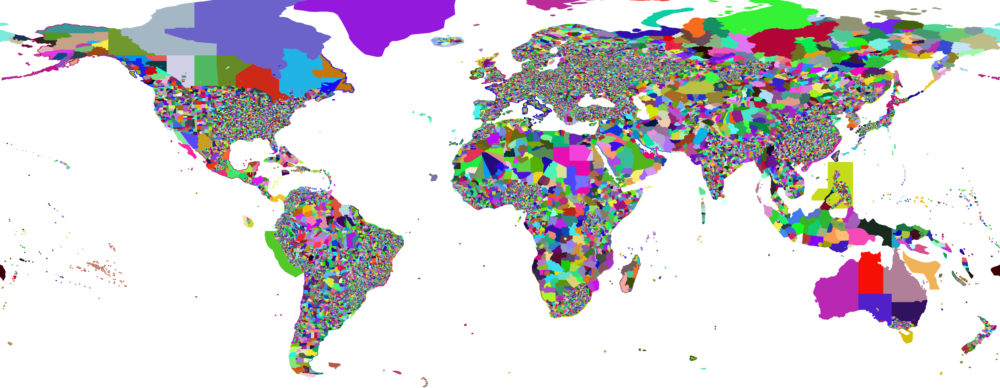
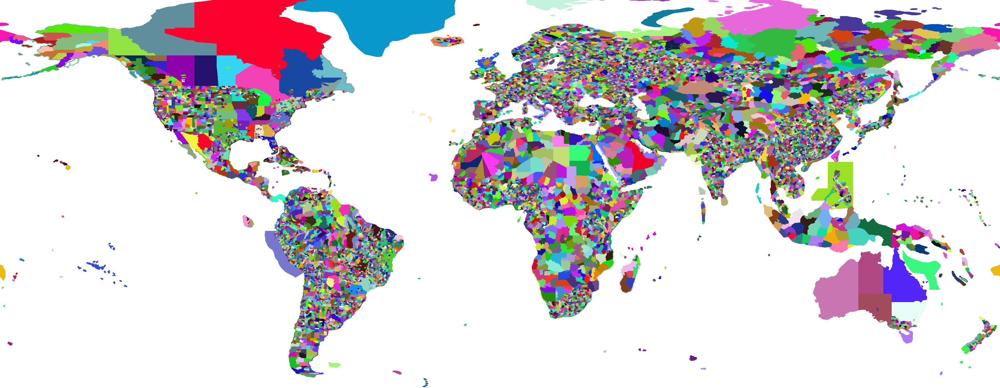

# Reverse-Geocoding Databases Derived from OpenStreetMap (OSM)

The data files in this folder are derived from OpenStreetMap.

OpenStreetMap data is © OpenStreetMap contributors.

For details on the license, consult the
[OpenStreetMap Copyright](http://www.openstreetmap.org/copyright),
[ODbL license text](http://opendatacommons.org/licenses/odbl/) reproduced
also in the file [LICENSE](LICENSE).

The following data files are currently provided:

## [osm-20150126-0.01.bin](osm-20150126-0.01.bin)

This data file has a resolution of 0.01 degree, and includes rather small
polygons (minimum bounding box size 4 pixels). This can sometimes be too
detailed for your usage. But on the other hand, it will recognize major
cities by name. It includes 39645 entities.

## [osm-20150126-0.02.bin](osm-20150126-0.02.bin)

This data file has the resolution reduced to 0.02 degree, with the same
bounding box threshold (4 pixels, but 4 times as large as in
the other file due to the decreased resolution).
Thus it provides a much coarser view on the data, containing 29008 entities.
It often does not even provide county level information.

## [osm-20150126-0.05.bin](osm-20150126-0.05.bin)

This data file has the resolution reduced to 0.05 degree, with 4 pixel minimum size.
It provides an even coarser view on the data, containing 18282 entities.
It often does not even provide county level information.

## [osm-20150126-0.10.bin](osm-20150126-0.10.bin)

This data file has the resolution reduced to 0.10 degree, with 4 pixel minimum size.
It provides an even coarser view on the data, containing 11214 entities.
It often does not even provide county level information.

In this image, you can also see that the data includes coastal areas as claimed
by the countries. A coordinate off the coast of Peru will thus still yield the
result Peru.

## Columns

All these data files are built from the same source, and the columns included are

1. Name as used on OSM (usually a localized name)
2. International or English name (often a transcribed name)
3. A 2-letter country code, if available (often not available on detailed levels)
4. A place type, if available (e.g. city, county, ...)
5. A link to Wikipedia, preferrably to the localized version
6. [WikiData](http://www.wikidata.org/) entry id, if annotated
7. Administrative level as [used by OSM](http://wiki.openstreetmap.org/wiki/Tag:boundary%3Dadministrative),
but usage may vary across countries.

### Examples

The following are some example results from the 0.01 resolution file.
Each row is one entity reported, and ` | ` indicates a tab separator.

In Manhattan:

    New York City | New York City         | US | city  | en:New York City |        | 5
    New York      | New York              | US |       | en:New York      | Q1384  | 4
    United States of America|United States of America|US||en:United States| Q30    | 2

At the center of Munich:

    München       | Munich                |    | city  | de:München       | Q1726  | 6
    Oberbayern    | Upper Bavaria         |    |       | de:Oberbayern    | Q10562 | 5
    Bayern        | Free State of Bavaria | DE | state | de:Bayern        | Q980   | 4
    Deutschland   | Germany               | DE |       | de:Deutschland   | Q183   | 2

In the Mediterranean Sea close to Spain:

    España        | Spain                 | ES |       | es:España        | Q29   | 2

Yes, there may be errors in the data. They should be fixed in [OpenStreetMap](http://www.openstreetmap.org/)
