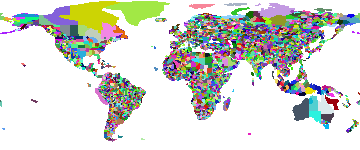
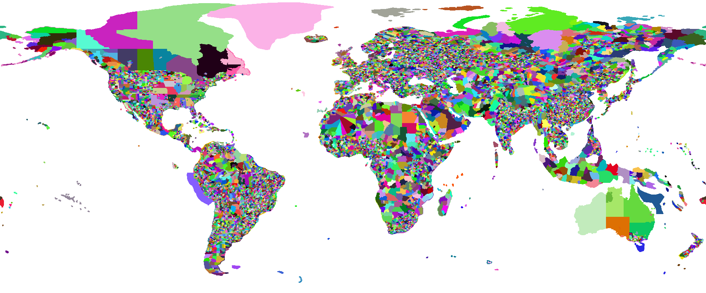

# Reverse-Geocoding Databases Derived from OpenStreetMap (OSM)

The data files in this folder are derived from OpenStreetMap.

OpenStreetMap data is © OpenStreetMap contributors.

For details on the license, consult the
[OpenStreetMap Copyright](http://www.openstreetmap.org/copyright),
[ODbL license text](http://opendatacommons.org/licenses/odbl/) reproduced
also in the file [LICENSE](LICENSE).

The following data files are currently provided:

## [osm-20151130-1.0-2.bin](osm-20151130-1.0-2.bin)

| Attribute                 | Value                            |
|---------------------------|----------------------------------|
| Map size:                 | 360 x 150                        |
| Map area:                 | lon -180.0-180.0 lat -65.0-85.0  |
| Total size:               | 825273 (0.787 MB)                |
| Size of map data:         | 23710 (0.023 MB)                 |
| Average bytes per row:    | 158.1                            |
| Row compression factor:   | 2.3                              |
| Metadata entries:         | 3575                             |
| Size of metadata:         | 786627 (0.750 MB)                |
| Average bytes per meta:   | 220.0                            |
| Total bytes per pixel:    | 15.282833                        |

## [osm-20151130-0.5-2.bin](osm-20151130-0.5-2.bin)

| Attribute                 | Value                            |
|---------------------------|----------------------------------|
| Map size:                 | 720 x 300                        |
| Map area:                 | lon -180.0-180.0 lat -65.0-85.0  |
| Total size:               | 1679735 (1.602 MB)               |
| Size of map data:         | 63672 (0.061 MB)                 |
| Average bytes per row:    | 212.2                            |
| Row compression factor:   | 3.4                              |
| Metadata entries:         | 6719                             |
| Size of metadata:         | 1587951 (1.514 MB)               |
| Average bytes per meta:   | 236.3                            |
| Total bytes per pixel:    | 7.776551                         |

## [osm-20151130-0.2-2.bin](osm-20151130-0.2-2.bin)

| Attribute                 | Value                            |
|---------------------------|----------------------------------|
| Map size:                 | 1800 x 750                       |
| Map area:                 | lon -180.0-180.0 lat -65.0-85.0  |
| Total size:               | 3653595 (3.484 MB)               |
| Size of map data:         | 225641 (0.215 MB)                |
| Average bytes per row:    | 300.9                            |
| Row compression factor:   | 6.0                              |
| Metadata entries:         | 13240                            |
| Size of metadata:         | 3371958 (3.216 MB)               |
| Average bytes per meta:   | 254.7                            |
| Total bytes per pixel:    | 2.706367                         |

## [osm-20151130-0.1-2.bin](osm-20151130-0.1-2.bin)

[Visualization 3600x1500](osm-20151130-0.1-2.png)

| Attribute                 | Value                            |
|---------------------------|----------------------------------|
| Map size:                 | 3600 x 1500                      |
| Map area:                 | lon -180.0-180.0 lat -65.0-85.0  |
| Total size:               | 6382346 (6.087 MB)               |
| Size of map data:         | 589784 (0.562 MB)                |
| Average bytes per row:    | 393.2                            |
| Row compression factor:   | 9.2                              |
| Metadata entries:         | 21644                            |
| Size of metadata:         | 5699950 (5.436 MB)               |
| Average bytes per meta:   | 263.4                            |
| Total bytes per pixel:    | 1.181916                         |

## [osm-20151130-0.05-2.bin](osm-20151130-0.05-2.bin)

[Visualization 7200x3000](osm-20151130-0.05-2.png)

| Attribute                 | Value                            |
|---------------------------|----------------------------------|
| Map size:                 | 7200 x 3000                      |
| Map area:                 | lon -180.0-180.0 lat -65.0-85.0  |
| Total size:               | 10249682 (9.775 MB)              |
| Size of map data:         | 1450648 (1.383 MB)               |
| Average bytes per row:    | 483.5                            |
| Row compression factor:   | 14.9                             |
| Metadata entries:         | 31124                            |
| Size of metadata:         | 8662502 (8.261 MB)               |
| Average bytes per meta:   | 278.3                            |
| Total bytes per pixel:    | 0.474522                         |

## [osm-20151130-0.02-2.bin](osm-20151130-0.02-2.bin)

[Visualization 10000x7500](osm-20151130-0.02-2.png)

| Attribute                 | Value                            |
|---------------------------|----------------------------------|
| Map size:                 | 18000 x 7500                     |
| Map area:                 | lon -180.0-180.0 lat -65.0-85.0  |
| Total size:               | 19409068 (18.510 MB)             |
| Size of map data:         | 4513295 (4.304 MB)               |
| Average bytes per row:    | 601.8                            |
| Row compression factor:   | 29.9                             |
| Metadata entries:         | 47575                            |
| Size of metadata:         | 14675437 (13.996 MB)             |
| Average bytes per meta:   | 308.5                            |
| Total bytes per pixel:    | 0.143771                         |

## [osm-20151130-0.01-2.bin](osm-20151130-0.01-2.bin)

| Attribute                 | Value                            |
|---------------------------|----------------------------------|
| Map size:                 | 36000 x 15000                    |
| Map area:                 | lon -180.0-180.0 lat -65.0-85.0  |
| Total size:               | 31303949 (29.854 MB)             |
| Size of map data:         | 10435583 (9.952 MB)              |
| Average bytes per row:    | 695.7                            |
| Row compression factor:   | 51.7                             |
| Metadata entries:         | 64597                            |
| Size of metadata:         | 20549942 (19.598 MB)             |
| Average bytes per meta:   | 318.1                            |
| Total bytes per pixel:    | 0.057970                         |

## [osm-20151130-0.005-2.bin](osm-20151130-0.005-2.bin)

| Attribute                 | Value                            |
|---------------------------|----------------------------------|
| Map size:                 | 72000 x 30000                    |
| Map area:                 | lon -180.0-180.0 lat -65.0-85.0  |
| Total size:               | 51483241 (49.098 MB)             |
| Size of map data:         | 23856389 (22.751 MB)             |
| Average bytes per row:    | 795.2                            |
| Row compression factor:   | 90.5                             |
| Metadata entries:         | 85630                            |
| Size of metadata:         | 27164296 (25.906 MB)             |
| Average bytes per meta:   | 317.2                            |
| Total bytes per pixel:    | 0.023835                         |

## osm-20151130-0.002-2.bin

| Attribute                 | Value                            |
|---------------------------|----------------------------------|
| Map size:                 | 180000 x 75000                   |
| Map area:                 | lon -180.0-180.0 lat -65.0-85.0  |
| Total size:               | 111273361 (106.119 MB)           |
| Size of map data:         | 70830718 (67.549 MB)             |
| Average bytes per row:    | 944.4                            |
| Row compression factor:   | 190.6                            |
| Metadata entries:         | 126211                           |
| Size of metadata:         | 39637763 (37.802 MB)             |
| Average bytes per meta:   | 314.1                            |
| Total bytes per pixel:    | 0.008242                         |

This file exceeds the GitHub 100 MB file limit.
It will be made available in the [Open Data LMU](http://data.ub.uni-muenchen.de/61/) repository instead.

## osm-20151130-0.001-2.bin

| Attribute                 | Value                            |
|---------------------------|----------------------------------|
| Map size:                 | 360000 x 150000                  |
| Map area:                 | lon -180.0-180.0 lat -65.0-85.0  |
| Total size:               | 212171663 (202.343 MB)           |
| Size of map data:         | 157478777 (150.183 MB)           |
| Average bytes per row:    | 1049.9                           |
| Row compression factor:   | 342.9                            |
| Metadata entries:         | 169718                           |
| Size of metadata:         | 53413978 (50.940 MB)             |
| Average bytes per meta:   | 314.7                            |
| Total bytes per pixel:    | 0.003929                         |

This file exceeds the GitHub 100 MB file limit.
It will be made available in the [Open Data LMU](http://data.ub.uni-muenchen.de/61/) repository instead.

## osm-20151130-0.0005-2.bin

| Attribute                 | Value                            |
|---------------------------|----------------------------------|
| Map size:                 | 720000 x 300000                  |
| Map area:                 | lon -180.0-180.0 lat -65.0-85.0  |
| Total size:               | 408922172 (389.979 MB)           |
| Size of map data:         | 339683647 (323.948 MB)           |
| Average bytes per row:    | 1132.3                           |
| Row compression factor:   | 635.9                            |
| Metadata entries:         | 213381                           |
| Size of metadata:         | 67184965 (64.073 MB)             |
| Average bytes per meta:   | 314.9                            |
| Total bytes per pixel:    | 0.001893                         |

This file exceeds the GitHub 100 MB file limit.
It will be made available in the [Open Data LMU](http://data.ub.uni-muenchen.de/61/) repository instead.

## Columns

All these data files are built from the same source, and the columns included are

1. Name as used on OSM (usually a localized name)
2. International or English name (often a transcribed name)
3. A place type, if available (e.g. city, county, ... but not very complete)
4. A link to Wikipedia, preferrably to the localized version
5. [WikiData](http://www.wikidata.org/) entry id, if annotated
6. An OpenStreetMap reference, either a way id `w` or a relation id `r`
7. Administrative level as [used by OSM](http://wiki.openstreetmap.org/wiki/Tag:boundary%3Dadministrative),
but usage may vary across countries.

### Examples

The following are some example results from the 0.01 resolution file.
Each row is one entity reported, and ` | ` indicates a tab separator.

In Manhattan:

    New York County     | New York County   | county | en:Manhattan     |     | r2552485| 6
    New York City       | New York City     | city   | en:New York City |     | r175905 | 5
    New York            | New York          |        | en:New York      |Q1384| r61320  | 4
    United States of America|United States of America||en:United States | Q30 | r148838 | 2

At the center of Munich:

    München     | Munich                | city  | de:München     | Q1726| r62428 | 6
    Oberbayern  | Upper Bavaria         |       | de:Oberbayern  |Q10562|r2145274| 5
    Bayern      | Free State of Bavaria | state | de:Bayern      | Q980 |r2145268| 4
    Deutschland | Germany               |       | de:Deutschland | Q183 | r51477 | 2

Yes, there may be errors in the data. They should be fixed in [OpenStreetMap](http://www.openstreetmap.org/)

For example in Western Australia the city of Perth and other boundaries are missing, and Canada could also use some love.
